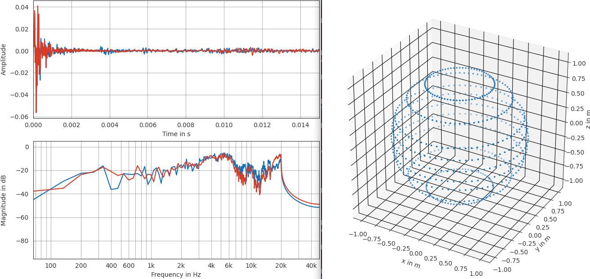
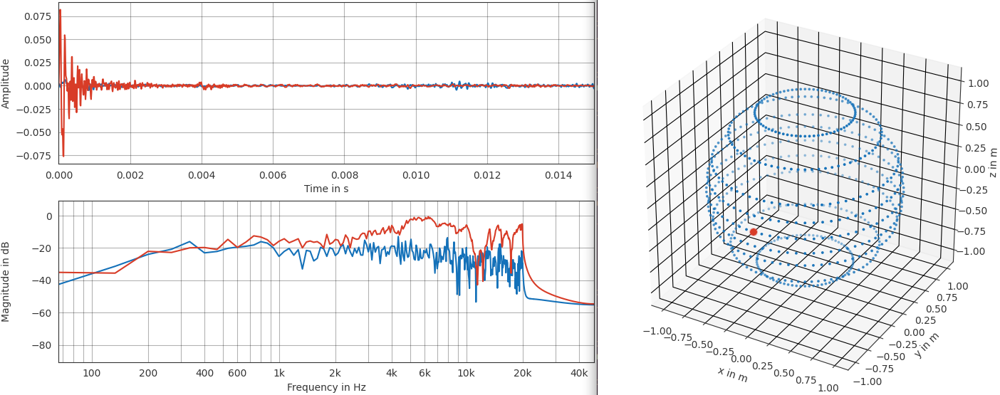

# Tool: display_sofa

This tool is located under "verse/tools/bin" folder and its purpose is to show the content of a .sofa file (Spatially Oriented Format for Audio)

This file format is defined by the Audio Engineering Society (AES) within the standard [AES69-2022](https://www.aes.org/publications/standards/search.cfm?docID=99) see also [sofaconventions](https://www.sofaconventions.org/mediawiki/index.php/SOFA_(Spatially_Oriented_Format_for_Acoustics))

VERSE usese this format for both the HRTF (head related transfer function) and RIR (room impulse response).

## syntax
The syntax of this command has the following options:

```
./display_sofa.py -h
usage: display_sofa.py [-h] [-l] [-yp YAML_PARAMS] [-mf MEASURE_FILE] [-c CPU_PROCESS] [-g GRAPHS] [-ssc] [-src] [-sss SHOW_SELECTED_SOURCE]
                       [-ssr SHOW_SELECTED_RECEIVER] [-v] [-log LOGFILE]

Read compute_hrir results and save SOFA file (Spatially Oriented Format for Acoustics)

options:
  -h, --help            show this help message and exit
  -l, --list_folders    show list of available sessions
  -yp YAML_PARAMS, --yaml_params YAML_PARAMS
                        yaml input params file (default: None)
  -mf MEASURE_FILE, --measure_file MEASURE_FILE
                        SOFA file to open
  -c CPU_PROCESS, --cpu_process CPU_PROCESS
                        maximum number of CPU process to use
  -g GRAPHS, --graphs GRAPHS
                        skip, save, show, show_and_save (default: show)
  -ssc, --show_sources_coordinates
                        show sources coordinates (default: False)
  -src, --show_receivers_coordinates
                        show receivers coordinates (default: False)
  -sss SHOW_SELECTED_SOURCE, --show_selected_source SHOW_SELECTED_SOURCE
                        show impulse response for selected source, shperical coordinates (default: 0,0,1)
  -ssr SHOW_SELECTED_RECEIVER, --show_selected_receiver SHOW_SELECTED_RECEIVER
                        show impulse response for selected receiver on selected source, trackid or all (default: all)
  -v, --verbose         verbose (default: False)
  -log LOGFILE, --logfile LOGFILE
                        log verbose output to file (default: None)
```

## usage
This tool is needed to visualize the position in space of source/emitters and listener/receivers. This tool will also visualize the audio measure (impulse response) associated to the specified source and receiver (or all of them if they are not specified)

As an example we can reference the "head_003" from "[VERSE]/resources/heads/unimore/files" folder. Here we can find more .sofa file that are associated to different pairs of receivers.

```
.
├── head_001
│   └── head_001.sofa
└── head_003
    ├── dry-20250223_001_array_six_front.sofa
    ├── dry-20250223_001_array_six_middle.sofa
    ├── dry-20250223_001_array_six_rear.sofa
    └── dry-20250223_001_binaural.sofa
```

Using the "dry-20250223_001_binaural.sofa" file we can display all source positions and measure with the command:

```
cd [VERSE]/resources/heads/unimore/files
[VERSE]/tools/bin/display_sofa.py -mf ./head_003/dry-20250223_001_binaural.sofa -sss 0,0,1
```
the output shows the full map of available measures inside the .sofa file (on the right) with the selected source position in spherical coordinates (0,0,1) marked with a red dot on the map.
On the left the impulse response (and frequency response) of the selected source for both receivers (VERSE is rendering pairs of receivers because of the 3DTune-In library)



If we select a different source the impulse response will change. For example if we select a source from the right side of the listener (azimuth 270 deg) we will get:



note how the impulse response is different between the two receivers (mics placed into ears positions) due to the marking effect of the head.
